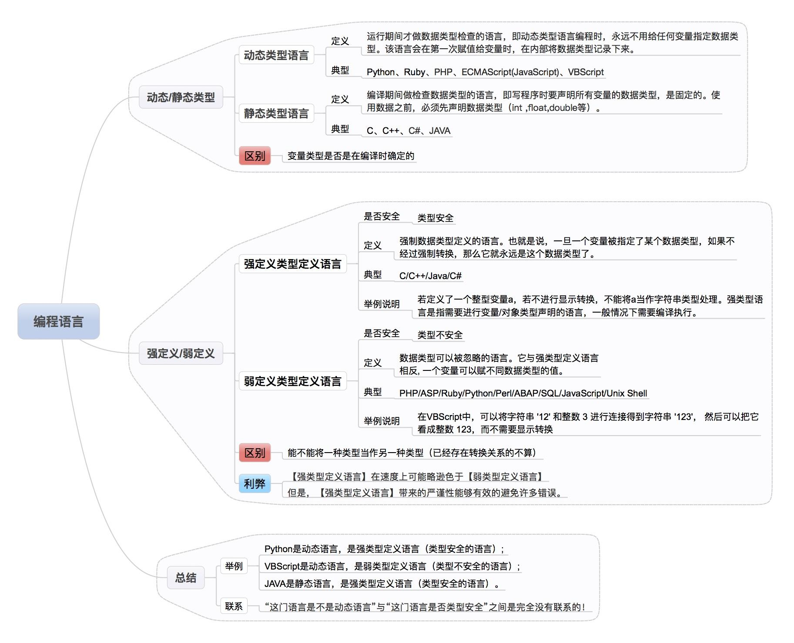

# 2020-2021学年第2学期

# **实 验 报 告**


- 课程名称:跨平台脚本开发技术  
- 实验项目:JavaScript入门
- 专业班级:计算机1801
- 学生学号:31801061
- 学生姓名:王灵霜
- 实验指导教师:郭鸣

## 实验目标

掌握NodeJS, Chrome开发工具的使用，熟悉JavaScript的值与类型系统

## 实验内容
1. 开发工具使用。
    - 安装[开发工具](/tools/) Nodejs, Chrome, VS Code, Git
    - 运行node 进入REPL(Read Eval Print Loop) 运行下面的命令
        - .help
        
          
        
        - .load  prog.js   //事先编辑好 prog.js 文件Fibonacci计算程序
        
          
        
    - .exit
    - node  解释器方式运行教材上的你选任意程序, 将程序保存到prog.js 文件中
        - node prog.js
        
            
        
    - node debug prog.js
            - help 查看 调试器用法 
        
        
        
        - 练习  run, restart, next, cont, sb(), list(),watch等命令的使用。
        
          run:运行代码，在第一行暂停
        
          
        
          restart:重新运行代码
        
          
        
          next:运行下一行
        
          
        
          cont:继续运行到下一个断点
        
          
        
          sb():在当前行设置断点
        
          
        
          list():显示当前执行到的后?行代码
        
          
        
          watch():把?加入监视列表(好像没成功)
        
          
        
    - Chrome Devtools 按`ctrl+shift+j/F12` 进入Devtools界面
    -  建立一个 code.html 文件，内容如下： `<script src='code.js'></script>`
        -  建立一个code.js 文件 放置你的代码 
        - 用Chrome打开 code.html,按 `ctrl+shift+j` 进入Devtools界面，在此界面，可以调试 JavaScript代码。

```js
// code.js
function numberToString(n, base) {
    var result = "", sign = "";
    if (n < 0) {
    sign = "-";
    n = -n;
    }
    do {
    result = String(n % base) + result;
    n /= base;
    } while (n > 0);
    return sign + result;
}
console.log(numberToString(13, 10));
// → 1.5e-3231.3e-3221.3e-3211.3e-3201.3e-3191.3e-3181.3…
```

运行结果:


调试:


1. 阅读[JavaScript 指南][MDN]  介绍 语法与数据类型  控制流与错误处理 循环与迭代 表达式和运算符 

   ##### 语法与数据类型

   - 语法

     - JavaScript借鉴了Java的大部分语法，使用Unicode字符集；

     - 大小写敏感；

     - 指令被称为语句（Statement），并使用‘；’作为语句结尾；

     - 使用//进行单行注释，/* */进行多行注释；

     - 有三种变量声明方式：`var`，声明一个变量，可选初始化一个值。`let`，声明一个块作用域的局部变量，可选初始化一个值。`const`，声明一个块作用域的只读常量。

     - 用 `var` 或 `let` 语句声明的变量，如果没有赋初始值，则其值为 `undefined` 。

     - 特殊的变量、类型：undefined、NaN

       NaN == NaN // ➝ False

   - 数据类型

     - 七种基本数据类型:

       ①布尔值（Boolean），有2个值分别是：`true` 和 `false`.

       ②null ， 一个表明 null 值的特殊关键字。 JavaScript 是大小写敏感的，因此 `null` 与 `Null`、`NULL`或变体完全不同。

       ③undefined ，和 null 一样是一个特殊的关键字，undefined 表示变量未赋值时的属性。

       ④数字（Number），整数或浮点数，例如： `42` 或者 `3.14159`。

       ⑤任意精度的整数 (BigInt) ，可以安全地存储和操作大整数，甚至可以超过数字的安全整数限制。

       ⑥字符串（String），字符串是一串表示文本值的字符序列，例如："Howdy" 。

       ⑦代表（Symbol） ( 在 ECMAScript 6 中新添加的类型).。一种实例是唯一且不可改变的数据类型。

     - 以及对象（Object）。

   ##### 控制流与错误处理

   - 最基本的语句是用于组合语句的语句块，使用`{ }`来界定；
   - 控制流主要有：条件分支、条件循环、增强跳转；
   - 错误处理：
     - `throw Error`
     - `try ...  catch ...`
     - `try ...  catch ... finally ...`

   ##### 循环与迭代

   - 循环（迭代）:
     - `for ( ; ; )`
     - `for each ... in`
     - `for ... in`
     - `for ...  of `
     - `while`
     - `do ... while`
   - 增强跳转
     - `break [label]`
     - `continue [label]`

   ##### 表达式

   - 表达式是一组代码的集合，返回一个值。

   - JavaScript有以下表达式类型：

     - 算数: 得出一个数字, 例如 3.14159；

     - 字符串: 得出一个字符串, 例如, "Fred" 或 "234"；
     - 逻辑值: 得出true或者false；
     - 基本表达式: javascript中基本的关键字和一般表达式；
     - 左值表达式: 分配给左值；

   ##### 运算符

   - 赋值运算符

     `=`；`+=`；`-=`；`*=`；`/=`；`%=`；`**=`；`<<=`；`>>=`；`>>>=`；`&=`；`^=`；`|=`；

   - 比较运算符

     `==`；`!=`；`===`；`!==`；`>`；`>=`；`<`；`<=`；

   - 算数运算符

     `%`；`++`；`--`；`-`；`+`；`**`；

   - 位运算符

     `&`；`|`；`^`；`~`；`<<`；`>>`；`>>>`；

   - 逻辑运算符

     `&&`；`||`；`!`；

   - 字符串运算符

     `+`；`+=`；

   - 条件（三元）运算符

     `条件 ? 值1 : 值2`；

   - 逗号运算符

     `,`；

   - 一元运算符

     `delete`；`typeof`；`void`；

   - 关系运算符

     `in`；`instanceof`；

1. 阅读教材前言、第一、二章，并在`Nodejs` 和 `Chrome DevTool` 中运行其中的代码

- http://sigcc.gitee.io/eloquent-js-3e-zh/
  
1. 完成教材第二章 习题 p23-24 习题 1,2,3

    ```javascript
    /**
     * 编写一个循环，对console.log进行七次调用以输出以下三角形:
     * #
     * ##
     * ###
     * ####
     * #####
     * ######
     * #######
     */
    function qes_1() {
        let result = "";
        for (let i = 0; i < 7; i++) {
            result += "#";
            console.log(result);
        }
    }
    /**
     * 编写一个使用console.log打印出从1到100之间所有数字，但有两种情况除外的程序。
     * 对于能被3整除的数字，打印"Fizz"而不是这个数字。
     * 对于能被5整除（但不能被3整除）的数字，请改为打印"Buzz"。
     * 完成上述任务后，请修改程序，将同时被3与5整除的数字打印为"FizzBuzz"。
     * （对于只能被3和5的一个蒸出的数字，仍打印"Fizz"或"Buzz"）。
     */
    function qes_2() {
        let result = "";
        for (let i = 1; i <= 100; i++) {
            if(i%3==0){
                result = result + "Fizz";
                if(i%5==0){
                    result = result + "Buzz";
                }
            }
            else if(i%5==0){
                result = result + "Buzz";
            }
            else{
                result = result + i;
            }
            result = result + "\t";
            if (i % 10 == 0)
                result += "\n";
        }
        console.log(result);
    }
    /*
     *编写一个程序，创建表示8×8的网格的字符串，使用换行字符分隔行。
     *在网格的每个位置都有一个空格或#字符。这些字符应该组成一个国际象棋棋盘。
     *将此字符串传给console.log应显示类似内容：
     * # # # #
     *# # # # 
     * # # # #
     *# # # # 
     * # # # #
     *# # # # 
     * # # # #
     *# # # # 
     *当程序生成此图案时，请定义绑定size = 8并修改此程序，
     *使其适用于任何size，并显示给定宽度和高度的网格。
     */
    function qes_3() {
        let size = 8;
        let result = "";
        for (let i = 0; i < size; i++) {
            for (let j = 0; j < size; j++) {
                result += (i + j) % 2 == 0 ? " " : "#";
            }
            result += "\n";
        }
        console.log(result);
    }
    ```

    

1. 请说明 `var let const` 在声明变量时的区别

    `var`，声明一个变量，可选初始化一个值。

    `let`，声明一个块作用域的局部变量，可选初始化一个值。

    `const`，声明一个块作用域的只读常量。

1. 阅读教材 前言，第1章，第2章。结合  像计算机科学家一样思考python.pdf,说明下面的概念
    - 解释器

      - 直接执行由编程语言或脚本语言编写的代码，返回结果的程序。不会把源代码预编译成机器码。

    - 编译器

      - 将源代码编译为汇编语言的程序，目标代码通常会被转换成二进制的形式。

    - 类型

      - 七种基本数据类型:

        ①布尔值（Boolean），有2个值分别是：`true` 和 `false`.

        ②null ， 一个表明 null 值的特殊关键字。 JavaScript 是大小写敏感的，因此 `null` 与 `Null`、`NULL`或变体完全不同。

        ③undefined ，和 null 一样是一个特殊的关键字，undefined 表示变量未赋值时的属性。

        ④数字（Number），整数或浮点数，例如： `42` 或者 `3.14159`。

        ⑤任意精度的整数 (BigInt) ，可以安全地存储和操作大整数，甚至可以超过数字的安全整数限制。

        ⑥字符串（String），字符串是一串表示文本值的字符序列，例如："Howdy" 。

        ⑦代表（Symbol） ( 在 ECMAScript 6 中新添加的类型).。一种实例是唯一且不可改变的数据类型。

      - 以及对象（Object）。

    - 求值

      - 计算表达式的结果。

    - 表达式

      - 由变量、操作符和方法调用构成。

    - 语句

      - 一个会产生影响的代码单元，例如新建一个变量或显示某个值。大致相当于自然语言中的句子，构成一个完整的执行单元。

    - 语法错误 

      - 程序的语法有误，编译器或解译器在解析代码时无法将其转换为适当的编程语言。

    - 语义错误

      - 语句语法上没有错误，可以通过编译，可以运行，也可以得到结果，但结果偏离预期的结果。

1. 给出代码，举例说明JavaScript是动态类型，弱类型

```javascript
let x = 18;
x = "str";
console.log(typeof(x));
```


参考阅读：  
取自[编程语言傻傻分不清：弱类型、强类型、动态类型、静态类型](https://www.jianshu.com/p/336f19772046)


参考阅读： 代码之髓：编程语言核心概念.pdf


[MDN]: https://developer.mozilla.org/zh-CN/docs/Web/JavaScript/Guide
